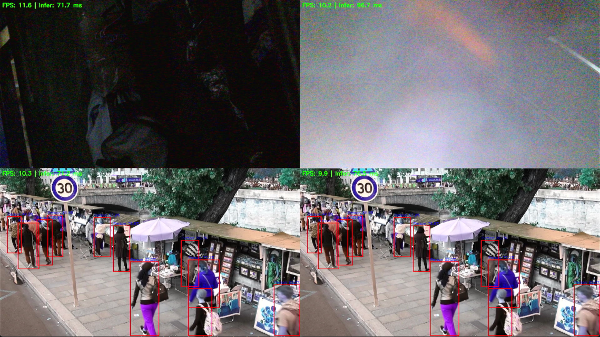

# RK3588/RK3576 YOLO11 DEMO

在rk3588/rk3576上使用yolo11进行目标识别

## 快速开始

1. 环境

```bash
sudo apt update
sudo apt install cmake
sudo apt install gcc g++
sudo apt install -y libopencv-dev pkg-config
sudo apt install -y \
libgstreamer1.0-dev \
libgstreamer-plugins-base1.0-dev \
libgtk-3-dev \
pkg-config
sudo apt install -y libgstrtspserver-1.0-dev
sudo apt-get install -y librga-dev
sudo apt-get install qtbase5-dev
```

2. 编写配置文件`config.json`，见`config.json.example`
3. 运行脚本`build_linux_rk.sh`

4. 效果，上方为USB摄像头输入，下方为RTSP输入。图像分辨率均为1280x720，模型Yolov11s



## Todo

1. rk3576下RGA调用可能有越界写，目前需要开辟更大的缓冲区防止报错？
2. RTSP输入超过1000p会黑屏？
3. 非零拷贝
4. qt5重写显示UI

## 参考

[rknn_model_zoo](https://github.com/airockchip/rknn_model_zoo)和[EASY-EAI](https://github.com/EASY-EAI/EASY-EAI-Toolkit-3576)