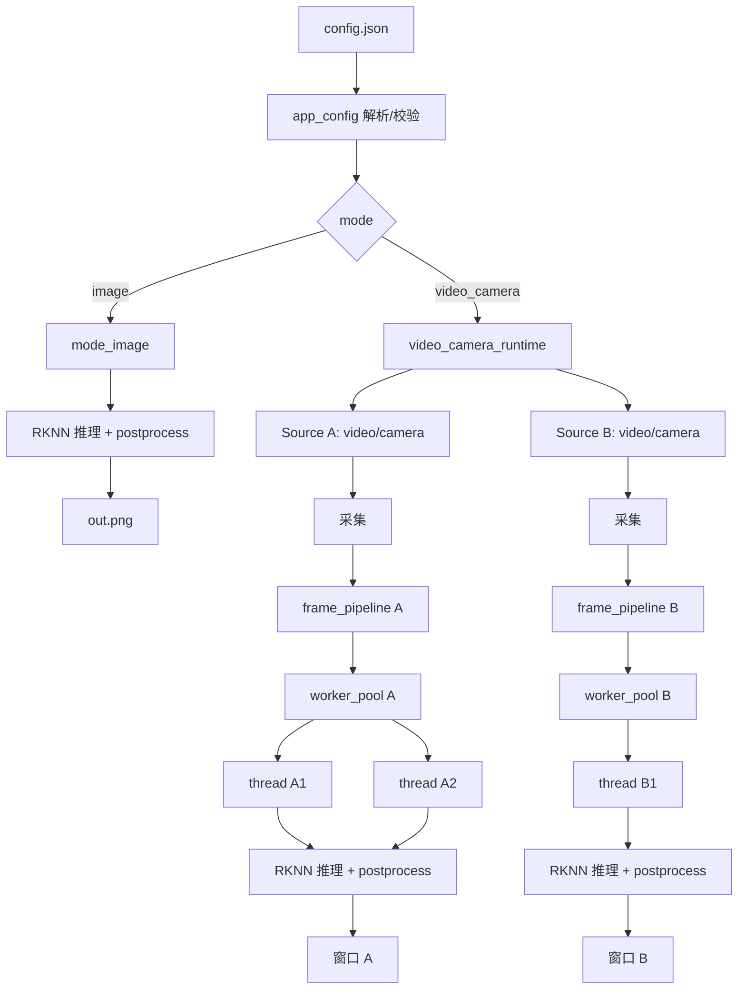
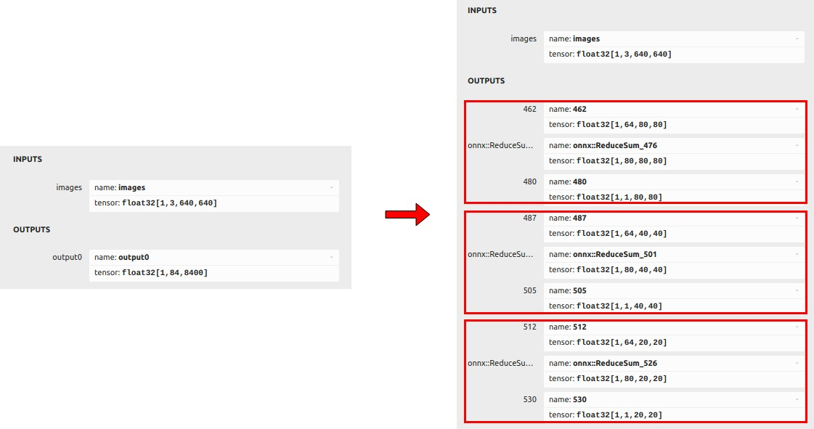

<h1 align="center">
    
    <br>
    盲区检测测试程序使用手册
    <br>
</h1>
## 目录


[TOC]

## 快速开始

此文件应该位于项目根目录下的`manual_developers.md`或`README.md`，推荐使用`Typora`打开

### 环境

在本次测试种，需要的硬件有

| 硬件名称          | 数量 | 备注                                       | 参考链接                                              |
| ----------------- | ---- | ------------------------------------------ | ----------------------------------------------------- |
| 香橙派5 开发板    | 1    | 运行Linux系统的嵌入式设备                  | https://ic-item.jd.com/10080394230954.html#none       |
| HDMI 接口的显示器 | 1    | 可以与`MIPI`屏幕二选一                     | 无                                                    |
| MIPI屏幕          | 1    | 可以与`HDMI`显示器二选一；分辨率为1280x720 | https://ic-item.jd.com/10082047246100.html#crumb-wrap |
| USB 摄像头        | 3    |                                            | https://ic-item.jd.com/10109343367261.html            |
| TF卡              | 1    | 至少32G                                    | https://ic-item.jd.com/10082047246108.html#crumb-wrap |
| 鼠标              | 1    | 任意USB接口均可                            | 无                                                    |
| 键盘              | 1    | 任意USB接口均可                            | 无                                                    |
| OTG转接器         | 1    |                                            | https://item.jd.com/100009644462.html                 |
| USB3.0-HUB        | 1    |                                            | https://item.jd.com/10161318857802.html               |
| WIFI模块          | 1    | ==如果==想连WIFI网络                       | https://ic-item.jd.com/10082047246101.html#crumb-wrap |
| 外壳              | 1    | 散热                                       | https://ic-item.jd.com/10082047246106.html#crumb-wrap |

本次测试软件环境为

| 软件名称                                                | 备注               | 参考链接                                                 |
| ------------------------------------------------------- | ------------------ | -------------------------------------------------------- |
| Orangepi5_1.2.2_ubuntu_jammy_desktop_xfce_linux5.10.160 | OS，==不需要准备== | https://pan.baidu.com/s/1MMyK2cA54zV-swELYAu5yw?pwd=mjbi |

### 硬件连接

#### 总览

您拿到的应该是==已经装好的设备==，故此处简单介绍一些重要硬件，如图：

- 图左的USB3.0口接USB-HUB,并以此接一个USB摄像头和键盘、鼠标
- 图左的USB2.0口接一个USB摄像头
- 图上方的type-c口通过OTG转接线接一个USB摄像头
- 图左上方的USB2.0因为存在接触不良的原因，可以接鼠标或键盘，但不建议接USB摄像头
- MIPI屏幕通过上方的屏幕排线与开发板连接
- 最右方的type-c口为==充电口==，不要和OTG使用的口混为一谈


> [!TIP]
>
> 对于各硬件内部——如MIPI屏幕——如何连接，查看手册末尾的香橙派官方手册

### 运行

查看`软件-使用方法`小节

---

## 硬件

下面列举一些本程序会用到硬件，核心硬件是==必须==拥有的，外围硬件可以根据需要购买


### 核心硬件

#### 香橙派5 开发板

拥有HDMI视频接口和多个USB接口，是程序运行的核心

推荐配置：

- 内存 ≥ 4G


**参考商品链接**：https://ic-item.jd.com/10080394230954.html#none

---

#### 摄像头

##### MIPI摄像头

走主板MIPI总线的摄像头OV13850，此主板提供3个可用接口，接口为上图Camera接口，即==最多3个MIPI摄像头==


**参考商品链接**：https://ic-item.jd.com/10082047246103.html#crumb-wrap

---
##### USB摄像头

走开发板USB接口的摄像头（必须支持UVC协议），受限于USB总线的带宽，每个USB摄像头可接一个


**参考商品链接**：https://ic-item.jd.com/10109343367261.html

> [!NOTE]
>
> 由于开发板的其中一个USB2.0接口与Type-C共用，故实际可用的USB接口为3个，即==最多3个USB摄像头==

---

#### TF卡

TF卡用于存储系统和程序数据，开发测试阶段推荐：

- 空间 ≥ 32G
- 速度 ≥ 100MB/s

常见品牌如闪迪、三星均可


**参考商品链接**：https://ic-item.jd.com/10082047246108.html#crumb-wrap

---

### 外围硬件
#### USB3.0-HUB

用于扩展USB接口


**参考商品链接**：https://item.jd.com/10161318857802.html

> [!TIP]
>
> 建议使用USB3.0（接口为蓝色）版本，与香橙派5上接口一致

---

#### OTG转接器（Type-C 转USB）

提供Type-C口转接功能


**参考商品链接**：https://item.jd.com/100009644462.html

> [!NOTE]
>
> 在实际测试中发现与Type-C共用的USB2.0接口接触不良，所以需要使用共用的Type-C接口

---


#### WIFI 模块

AP6275P PCIe WIFI6+蓝牙 5.0 二合一模块，用于无线连接WIFI


**参考商品链接**：https://ic-item.jd.com/10082047246101.html#crumb-wrap

---

#### MIPI屏幕

10.1 寸MIPI屏幕，用于显示开发板的系统界面


**参考商品链接**：https://ic-item.jd.com/10082047246100.html#crumb-wrap

> [!TIP]
>
> 此屏幕是1280x720分辨率，且使用排线连接，最好有HDMI显示器备用

---

#### 鼠标

用于操作开发板，与普通电脑要求相同，USB接口即可

**参考商品链接**：无

---

#### 键盘

用于操作开发板，与普通电脑要求相同，USB接口即可

**参考商品链接**：无

---

#### 外壳

配套外壳，用于散热和保护


**参考商品链接**：https://ic-item.jd.com/10082047246106.html#crumb-wrap

---


## 软件

### 程序介绍

==只是运行程序，不需要阅读此节==

> [!WARNING]
>
> 因为维护更新，可能与仓库中代码有区别，以仓库中代码为准

#### 程序概览

本程序在 RK3588 上运行 YOLO11 RKNN 模型，支持图片与多路视频/摄像头输入，主流程为：配置驱动 → 逐路采集 → 多线程推理 → 后处理/绘制 → OpenCV 窗口显示。

- 模式：`image`、`video_camera`（多路 source，video/camera 可混用）。
- 配置：`config.json` 由 `app_config` 解析与校验，支持每路 `conf_threshold`。
- 分层：配置层（解析/校验）→ 运行层（多路调度）→ 推理层（worker_pool + frame_pipeline）→ 模式层（image/video/camera）→ 后处理/绘制。
- 日志：基于 spdlog，控制台 info，文件 debug 级别。
- 编译运行：统一使用 `build_linux_rk3588.sh` 脚本，不再手动执行 cmake 命令。

#### 运行流程（Mermaid）



#### 前期环境配置

介绍如何配置开发环境，如何将训练好的`.pt`文件转为开发板可用的`.rknn`文件

#####  涉及设备

| 设备     | 系统                                                    | 用途                             | 备注                   |
| -------- | ------------------------------------------------------- | -------------------------------- | ---------------------- |
| PC电脑   | Ubuntu 24.04 LTS                                        | 导出模型、远程连接开发板开发程序 | 仅作模型转换，无需cuda |
| Orangepi | Orangepi5_1.2.2_ubuntu_jammy_desktop_xfce_linux5.10.160 | 运行程序                         |                        |

PC电脑并非一定是Linux系统，Windows下一样可以开发香橙派下的程序

只是如果你希望使用示例中的交叉编译等功能，就不得不在Linux下进行

此处摄像头使用的是官方的配套零件`OV13850`，请自行参照官方[用户手册](http://www.orangepi.cn/html/hardWare/computerAndMicrocontrollers/service-and-support/Orange-pi-5.html)安装；如果usb摄像头，他们大多是==免驱==（UVC）的

##### 1. PC上获得`rknn`步骤

本教程不涉及对yolo11进行微调的内容，而是假设已经有训练好的`.pt`文件

可以在[Ultralytics YOLO11](https://docs.ultralytics.com/zh/models/yolo11/)中下载官方训练好的的[yolo11n.pt](https://github.com/ultralytics/assets/releases/download/v8.3.0/yolo11n.pt)

###### 1.1 转为`onnx`

为了使rk3588的NPU最大限度发挥性能，`rk`对`Ultralytics`的转`onnx`的`exporter`方法进行了修改，并将修改后的代码放在[airockchip/ultralytics_yolo11](https://github.com/airockchip/ultralytics_yolo11)库中

在[导出 RKNPU 适配模型说明](https://github.com/airockchip/ultralytics_yolo11/blob/main/RKOPT_README.zh-CN.md)、[rknn_model_zoo README](https://github.com/airockchip/rknn_model_zoo/blob/main/examples/yolo11/README.md#3-pretrained-model)和后文提到的`model_comparison`中有对修改的说明

1. 首先拉取修改后的仓库

```bash
git clone https://github.com/airockchip/ultralytics_yolo11.git
```

2. 然后安装这个修改后的库，这里建议用`conda`防止与官版冲突，你可以查看`pyproject.toml`文件以查看`Python`依赖

```bash
conda create -n yolo11_rknn python=3.10 -y
conda activate yolo11_rknn
python -m pip install -U pip setuptools wheel

pip install "torch>=2.0" "torchvision>=0.15"

# 注意在ultralytics_yolo11目录下使用此命令
pip install -e .
```

注意`torch`是`CPU`版还是`GPU`版，注意`torch`和`torchvision`的对应关系

3. 导出为`onnx`，注意此处的`format`的`rknn`是指导出为`rk`优化后的`onnx`

```bash
yolo export model=yolo11n.pt format=rknn
```

---

使用`ultralytics`的原版导出为`onnx`会和`rk`的示例代码冲突，因为输出格式不同，需要单独修改后处理部分的代码



###### 1.2 转为rknn

`onnx`无法在`rk3588`的NPU上运行，必须转为`int8\uint8`量化，使用rk提供的`Python`脚本进行转换

1. 安装`RKNN Toolkit2`

```bash
# 在conda下
conda activate yolo11_rknn
pip install rknn-toolkit2
```

2. 下载`rk`示例代码库

```bash
git clone https://github.com/airockchip/rknn_model_zoo.git
```

3. 转为`rknn`

将上一步的`onnx`放到`model`文件夹下

```bash
# 在conda下
conda activate yolo11_rknn
cd /Project/rknn_model_zoo/examples/yolo11
python3 convert.py ../model/yolo11n.onnx rk3588 i8 ../model/yolo11n.rknn
```

---

`rknn_model_zoo`是`rk`的示例代码库，`example`文件夹下有多个可已在`rkNPU`下运行的模型，其中包括多个yolo版本，此处我们只用`yolo11`

##### 2. PC上交叉编译C++程序

有两种编译方法，交叉编译和本机编译，这里只介绍通过交叉编译的方法运行官方示例C++程序

###### 2.1 更新开发板环境

- `librknnrt.so` 是一个板端的 `runtime`库。
- `rknn_server` 是一个运行在开发板上的后台代理服务,用于接收 PC 通过 USB
  传输过来的协议,然后执行板端 `runtime` 库中对应的接口,并返回结果给 PC。

由于我们安装的都是最新版，所以这里需要==更新==板子上对应的的运行库

1. 下载RKNPU2

```bash
 git clone https://github.com/rockchip-linux/rknpu2
```

2. 更新

```bash
adb push rknpu2/runtime/RK3588/Linux/rknn_server/aarch64/usr/bin/* /usr/bin
adb push rknpu2/runtime/RK3588/Linux/librknn_api/aarch64/librknnrt.so /usr/lib
```

3. 重启

```bash
# 这一步是在香橙派5下
sudo restart_rknn.sh
```

###### 2.2 安装交叉编译器

```bash
sudo apt update
sudo apt install gcc-aarch64-linux-gnu g++-aarch64-linux-gnu
```

###### 2.3 编译

在`rknn_model_zoo`下

```bash
./build-linux.sh -t rk3588 -a aarch64 -d yolo11
```

###### 2.4 运行

查看`install`文件夹，里面是编译出来的程序

```bash
install
└── rk3588_linux_aarch64 # rk3588平台
  └── rknn_yolo11_demo
    ├── lib # 依赖库
    │	├── librga.so 
    │	└── librknnrt.so 
	├── model # 模型推理材料
	│	├── bus.jpg # 测试照片
	│   ├── coco_80_labels_list.txt # 检测类别
    │	└── yolo11n.rknn # 模型文件
	├── rknn_yolo11_demo # 可执行文件
    └── rknn_yolo11_demo_zero_copy # 零拷贝调用API的可执行文件
```

- 此处，`lib`文件夹可以不用，这是冗余
- 将文件夹复制到开发板上运行即可

```bash
./rknn_yolo11_demo model/yolo11.rknn model/bus.jpg
```

#### 代码文件

本代码主要采用香橙派本机编译的方式，代码文件夹结构如下：

```bash
/home/orangepi/dock_blindspot
├── .gitignore
├── 3rdparty
│   ├── CMakeLists.txt
│   ├── allocator
│   │   ├── dma
│   │   └── drm
│   ├── jpeg_turbo
│   │   ├── Linux
│   │   └── include
│   ├── json
│   │   └── include
│   ├── librga
│   │   ├── Linux
│   │   ├── README.md
│   │   ├── docs
│   │   └── include
│   ├── rknpu2
│   │   ├── Linux
│   │   └── include
│   ├── spdlog
│   │   ├── LICENSE
│   │   └── include
│   └── stb_image
│       ├── LICENSE.txt
│       ├── stb_image.h
│       └── stb_image_write.h
├── README.md
├── assets
│   ├── OrangePi_5_RK3588S_用户手册_v2.2.pdf
│   ├── image-20260110210015843.png
│   ├── image-20260110210101931.png
│   ├── image-20260111205224214.png
│   ├── image-20260111205301636.png
│   ├── image-20260111210142197.png
│   ├── image-20260111210214293.png
│   ├── image-20260111210334090.png
│   ├── image-20260111211427676.png
│   ├── image-20260111211650775.png
│   ├── image-20260111221031712.png
│   └── 屏幕截图 2026-01-08 200536.png
├── build
│   └── 
├── build_linux_rk3588.sh
├── config.json
├── datasets
│   └── 
├── logs
│   └── 
├── manual_developers.md
├── manual.pdf
├── model
│   ├── yolo11n.rknn
│   └── yolo11s.rknn
├── performance.sh
├── report
│   └── 
├── src
│   ├── CMakeLists.txt
│   ├── app
│   │   ├── app_core_types.h
│   │   ├── app_types.h
│   │   ├── config
│   │   ├── log
│   │   ├── modes
│   │   ├── pipeline
│   │   ├── runtime
│   │   ├── utils
│   │   └── worker
│   ├── main.cc
│   ├── postprocess
│   │   ├── postprocess.cc
│   │   └── postprocess.h
│   ├── rknpu2
│   │   ├── yolo11.cc
│   │   ├── yolo11.h
│   │   └── yolo11_zero_copy.cc
│   └── v4l2_camera
│       ├── v4l2_camera.cpp
│       └── v4l2_camera.h
└── utils
    ├── CMakeLists.txt
    ├── common.h
    ├── file_utils.c
    ├── file_utils.h
    ├── font.h
    ├── image_drawing.c
    ├── image_drawing.h
    ├── image_utils.c
    └── image_utils.h
```

##### 说明

**目录用途**

- src: 核心 C++ 代码，配置解析、模式调度、推理与相机采集主逻辑。
- utils: 通用图像/文件/绘制工具库（来源于 RKNN model zoo 的通用实现）。
- 3rdparty: 第三方依赖与预编译库（rknpu2、librga、jpeg_turbo、spdlog、json、stb 等）。
- build: CMake/Ninja 构建产物与可执行文件输出目录。

**目录用途（资源/运行）**

- model: RKNN 模型与标签文件（含 yolo11n/s 与自定义模型）。
- datasets: 示例图片/视频，用于 image 模式与 video_camera 的视频源。
- assets: 文档配图与 OrangePi 手册 PDF。
- logs: 运行日志与 MJPEG dump 目录（运行时自动创建）。

**主要文件（根目录）**

- README.md: 项目背景、运行方式、配置示例。
- manual_developers.md: 使用手册（硬件清单、模型转换流程、运行说明）。
- manual.pdf: 使用手册 PDF 版本。
- config.json: 运行配置模板（模式、模型路径、输入源等）。
- build_linux_rk3588.sh: RK3588 交叉编译脚本，清理并重建 build。
- performance.sh: 固定 CPU/NPU 频率并启动监控窗口的性能脚本（`sudo ./performance.sh`）。
- .gitignore: Git 忽略规则。

**主要文件（核心源码）**

- main.cc: 程序入口，读取 config.json、初始化日志/后处理并分发模式。
- app/config/app_config.cc: 配置解析与校验（general/modes/video_camera）。
- app/runtime/video_camera_runtime.cc: 多路 source 调度与统计汇总。
- app/pipeline/frame_pipeline.cc: 帧排队、顺序输出与背压控制。
- mode_image.cc / mode_video.cc / mode_camera.cc: 各运行模式实现。
- app_log.cc: 基于 spdlog 的日志初始化与滚动输出。
- app_worker.cc / app/worker/worker_pool.cc / app_types.h: 推理线程、队列与 NPU 核心绑定。
- yolo11.cc / yolo11_zero_copy.cc: RKNN 模型加载/推理封装（含零拷贝实验，暂未实现）。
- postprocess.cc / v4l2_camera.cpp: YOLO 后处理与 V4L2 采集实现。

**注意**

- config.json 以 general.mode 选择模式（image/video_camera）；modes.video_camera.sources 支持多路输入；width/height 必须成对出现，type 可省略由 name 前缀推断，fps 是处理上限。
- 线程默认 3，threads > 3 会按 NPU 核轮询分配（见 app/worker/worker_pool.cc）。
- postprocess.h 中类别数与阈值硬编码（OBJ_CLASS_NUM=7, BOX_THRESH=0.25, NMS_THRESH=0.45），自定义模型需同步调整标签与常量。
- 日志在 app_log.cc 中初始化，写入 dock_blindspot_*.log，单文件 5MB/保留 3 个，控制台仅输出 info 级别。
- V4L2 采集在 v4l2_camera.cpp，支持格式自动回退；MJPEG 解码失败会 dump 到 logs/mjpeg（最多 3 帧）。
- build_linux_rk3588.sh 会删除 build 并产出 build/demo，依赖 aarch64-linux-gnu 与 librknnrt.so；推荐使用该脚本完成编译/运行。
- performance.sh 需要 sudo 且会修改 CPU/NPU governor。

### 使用方式

视频演示版本在附录（markdown格式下）或手动查看`./assets/视频演示.mp4`

#### 1. 进入桌面

设备连接完成，开发板开机后进入桌面


#### 2. 进入项目文件夹

点击左上角`applications`，选择`File Manager`


在显示内容种找到`dock_blindspot`文件夹，双击进入


此时来到程序文件夹


#### 3. 配置运行参数

在`dock_blindspot`文件夹下右击鼠标，选择`open terminal here`打开终端


输入`v4l2-ctl --list-devices`


你将看到类似的输出

```bash
orangepi@orangepi5:~$ v4l2-ctl --list-devices
rkisp-statistics (platform: rkisp):
        /dev/video18
        /dev/video19

......

Q8 HD Webcam: Q8 HD Webcam (usb-fc800000.usb-1):
        /dev/video20
        /dev/video21
        /dev/media2

Q8 HD Webcam: Q8 HD Webcam (usb-fc800000.usb-2):
        /dev/video22
        /dev/video23
        /dev/media3
        
Q8 HD Webcam: Q8 HD Webcam (usb-xhci-hcd.10.auto-1):
        /dev/video24
        /dev/video25
        /dev/media4
```


其中结尾处3个`Q8 HD Webcam: Q8 HD Webcam`即为此次连接的3个USB摄像头，以其中一个为例

```bash
Q8 HD Webcam: Q8 HD Webcam (usb-fc800000.usb-1):
        /dev/video20
        /dev/video21
        /dev/media2
```

- /dev/video20：设备主路径
- /dev/video21：备用路径
- /dev/media2：提供元数据

找到`config.json`，此为配置文件


打开内容类似于：

```json
{
  "general": {
    "mode": "video_camera",
    "label": "./model/new/best3_labels_lists.txt",
    "model_path": "./model/new/bests3640silu.rknn"
  },
  "modes": {
    "video_camera": {
      "sources": [
        {
          "name": "camera.0",
          "type": "camera",
          "input": "/dev/video20",
          "threads": 1,
          "width": 800,
          "height": 600,
          "buffers": 2,
          "fps": 30,
          "format": "mjpg",
          "conf_threshold": 0.4
        },
        {
          "name": "camera.1",
          "type": "camera",
          "input": "/dev/video24",
          "threads": 1,
          "width": 800,
          "height": 600,
          "buffers": 2,
          "fps": 30,
          "format": "mjpg",
          "conf_threshold": 0.4
        },
        {
          "name": "camera.2",
          "type": "camera",
          "input": "/dev/video22",
          "threads": 1,
          "width": 800,
          "height": 600,
          "buffers": 2,
          "fps": 30,
          "format": "mjpg",
          "conf_threshold": 0.4
        }
      ]
    }
  }
}

```

在`"input"`项下填入摄像头设备主路径，例如`/dev/video20`，注意设备路径要用双引号围住`"/dev/videoXX"`，保存文件即可

> [!NOTE]
>
> 关于此配置文件具体使用方式，见`附录-配置文件说明`节 

#### 4. 运行程序

继续在`terminal`下输入`./build_linux_rk3588.sh`，将运行编译脚本并自动运行程序


> [!WARNING]
>
> 请确保编译环境配置完成，否则将编译失败，此时也可以使用编译好的程序，输入`./build/demo`

> [!CAUTION]
>
> 请确保此时终端显示的类似于`orangepi@orangepi5:~/dock_blindspot$`，表明终端当前在项目文件夹下
>

#### 5. 查看效果

一切正常，程序应该开始运行，并弹出对应路数的窗口


> [!TIP]
>
> 初始窗口被设置为最大`1280x720`，通过鼠标可以对窗口进行缩放

如果看到如下出错窗口，请排查摄像头路径填写是否正确、接触是否良好


运行结束后可以在/logs文件夹下查看运行日志


## 附录

### 配置文件说明
`config.json` 为程序在运行时的配置文件，用于选择模式、输入源等选项，在每次程序运行时读取

####  内容模板

```json
{
  "general": {
    "mode": "video_camera",
    "label": "./model/new/best3_labels_lists.txt",
    "model_path": "./model/new/bests3640silu.rknn"
  },
  "modes": {
    "image": {
      "input": "./datasets/bug2.jpg"
    },
    "video_camera": {
      "sources": [
        {
          "name": "camera.0",
          "type": "camera",
          "input": "/dev/video20",
          "threads": 1,
          "width": 800,
          "height": 600,
          "buffers": 2,
          "fps": 30,
          "format": "mjpg",
          "conf_threshold": 0.4
        },
        {
          "name": "camera.1",
          "type": "camera",
          "input": "/dev/video24",
          "threads": 1,
          "width": 800,
          "height": 600,
          "buffers": 2,
          "fps": 30,
          "format": "mjpg",
          "conf_threshold": 0.4
        },
        {
          "name": "camera.2",
          "type": "camera",
          "input": "/dev/video22",
          "threads": 1,
          "width": 800,
          "height": 600,
          "buffers": 2,
          "fps": 30,
          "format": "mjpg",
          "conf_threshold": 0.4
        }
      ]
    }
  }
}

```

#### 详细介绍
程序首先读取 `general` 下的内容，以确定接下来的 `mode`。

- 如果是 `video_camera`，则读取 `modes.video_camera.sources`，每路输入在数组中单独配置；单路时数组只保留一个配置即可。

- 如果是 `image` ，则读取 `modes.image` 下的内容，忽略其他配置。

`video_camera` 下的每个输入源支持配置 `name` / `type` / `input` / `threads` / `width` / `height` / `buffers` / `fps` / `format` / `conf_threshold`。

- `type` 可选；省略时会根据 `name` 前缀 `video.` / `camera.` 自动判断。
- `width` 与 `height` 必须同时出现。

可选参数:
- `width/height`: video 输入会在推理前 resize，camera 输入会尝试设置采集分辨率(驱动可能回落)
- `buffers`: 仅 camera 输入有效，对应 V4L2 缓冲区数量，多路时建议 2~3，默认 4
- `fps`: 最大处理帧率上限（video/camera 都适用），默认 30
- `format`: 仅 camera 输入有效，可选 `auto`/`mjpeg`/`yuyv`/`nv12`，默认 auto
- `conf_threshold`: 控制画框的可信度阈值，默认 0.25

默认行为:
- `format_fallback` 始终开启，优先格式失败时会自动回退到可用格式
- MJPEG 解码失败时会自动 dump 原始帧到 `logs/mjpeg`，最多 3 帧

### 香橙派官方手册

点击查看：[香橙派官方手册](./assets/OrangePi_5_RK3588S_用户手册_v2.2.pdf)

### 视频演示

需在Markdown阅读器下打开原`md`文件，推荐使用`Typora`打开，PDF版不支持播放视频，请手动查看`./assets/视频演示.mp4`

<video src="./assets/视频演示.mp4" controls=""></video>

### 开发板性能设置

在项目文件夹下有`performance.sh`，使用`sudo`命令运行。shell脚本将自动设置CPU、NPU至最大频率，并打开NPU、RGA和HTOP（CPU、内存）的监视面板

```shell
# xfce桌面下
# NPU 监控窗口
xfce4-terminal \
  --title="NPU Load" \
  --geometry=50x5+0+0 \
  -e "bash -c 'watch -n 0.1 cat /sys/kernel/debug/rknpu/load; exec bash'" &

# RGA 监控窗口
xfce4-terminal \
  --title="RGA Load" \
  --geometry=5x15+0+170 \
  -e "bash -c 'watch -n 0.1 cat /sys/kernel/debug/rkrga/load; exec bash'" &

# CPU / 内存 监控窗口（htop）
xfce4-terminal \
  --title="CPU & Memory (htop)" \
  --geometry=80x24+400+0 \
  -e "bash -c 'htop; exec bash'" &
```

> [!NOTE]
>
> 注意自动打开监控面板这项功能必须在xfce4桌面下


