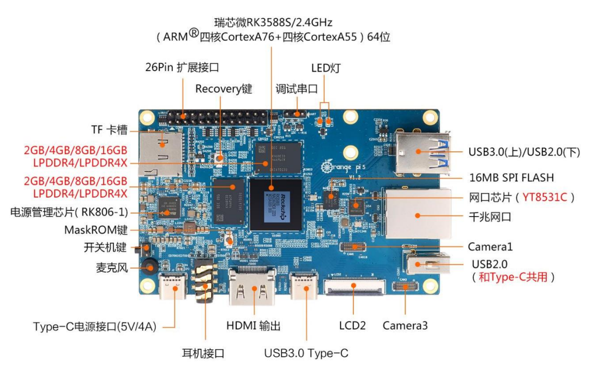
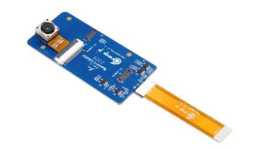
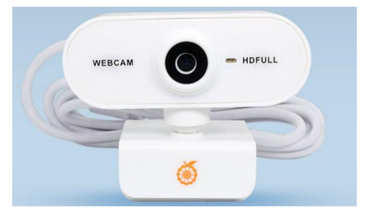
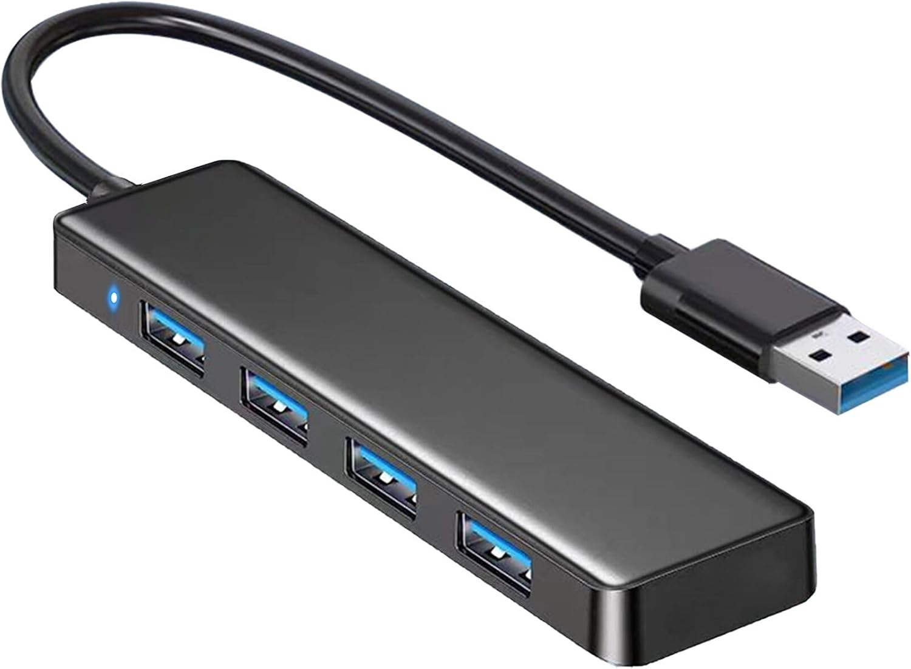
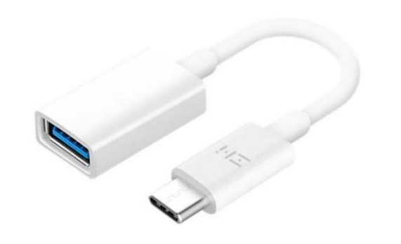
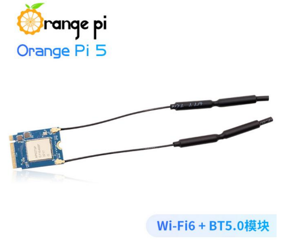
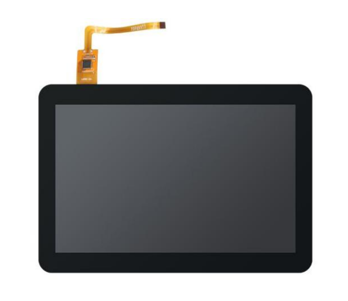
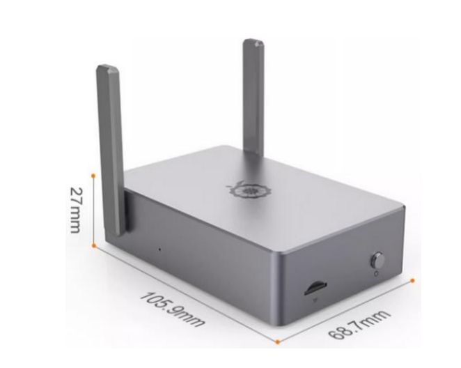

<h1 align="center">
    
    <br>
    盲区检测测试程序使用手册
    <br>
</h1>
## 目录


[TOC]

## 快速开始

此文件应该位于项目根目录下的`manual.md`或`README.md`，推荐使用`Typora`打开

### 环境

在本次测试种，需要的硬件有

| 硬件名称          | 数量 | 备注                                       | 参考链接                                              |
| ----------------- | ---- | ------------------------------------------ | ----------------------------------------------------- |
| 香橙派5 开发板    | 1    | 运行Linux系统的嵌入式设备                  | https://ic-item.jd.com/10080394230954.html#none       |
| HDMI 接口的显示器 | 1    | 可以与`MIPI`屏幕二选一                     | 无                                                    |
| MIPI屏幕          | 1    | 可以与`HDMI`显示器二选一；分辨率为1280x720 | https://ic-item.jd.com/10082047246100.html#crumb-wrap |
| USB 摄像头        | 3    |                                            | https://ic-item.jd.com/10109343367261.html            |
| TF卡              | 1    | 至少32G                                    | https://ic-item.jd.com/10082047246108.html#crumb-wrap |
| 鼠标              | 1    | 任意USB接口均可                            | 无                                                    |
| 键盘              | 1    | 任意USB接口均可                            | 无                                                    |
| OTG转接器         | 1    |                                            | https://item.jd.com/100009644462.html                 |
| USB3.0-HUB        | 1    |                                            | https://item.jd.com/10161318857802.html               |
| WIFI模块          | 1    | ==如果==想连WIFI网络                       | https://ic-item.jd.com/10082047246101.html#crumb-wrap |
| 外壳              | 1    | 散热                                       | https://ic-item.jd.com/10082047246106.html#crumb-wrap |

本次测试软件环境为

| 软件名称                                                | 备注               | 参考链接                                                 |
| ------------------------------------------------------- | ------------------ | -------------------------------------------------------- |
| Orangepi5_1.2.2_ubuntu_jammy_desktop_xfce_linux5.10.160 | OS，==不需要准备== | https://pan.baidu.com/s/1MMyK2cA54zV-swELYAu5yw?pwd=mjbi |

### 硬件连接

#### 总览

您拿到的应该是==已经装好的设备==，故此处简单介绍一些重要硬件，如图：

- 图左的USB3.0口接USB-HUB,并以此接一个USB摄像头和键盘、鼠标
- 图左的USB2.0口接一个USB摄像头
- 图上方的type-c口通过OTG转接线接一个USB摄像头
- 图左上方的USB2.0因为存在接触不良的原因，可以接鼠标或键盘，但不建议接USB摄像头
- MIPI屏幕通过上方的屏幕排线与开发板连接
- 最右方的type-c口为==充电口==，不要和OTG使用的口混为一谈


> [!TIP]
>
> 对于各硬件内部——如MIPI屏幕——如何连接，查看手册末尾的香橙派官方手册

### 运行

查看`软件-使用方法`小节

---

## 硬件

下面列举一些本程序会用到硬件，核心硬件是==必须==拥有的，外围硬件可以根据需要购买

### 核心硬件

#### 香橙派5 开发板

拥有HDMI视频接口和多个USB接口，是程序运行的核心

推荐配置：

- 内存 ≥ 4G



**参考商品链接**：https://ic-item.jd.com/10080394230954.html#none

---

#### 摄像头

##### MIPI摄像头

走主板MIPI总线的摄像头OV13850，此主板提供3个可用接口，接口为上图Camera接口，即==最多3个MIPI摄像头==



**参考商品链接**：https://ic-item.jd.com/10082047246103.html#crumb-wrap

---
##### USB摄像头

走开发板USB接口的摄像头（必须支持UVC协议），受限于USB总线的带宽，每个USB摄像头可接一个



**参考商品链接**：https://ic-item.jd.com/10109343367261.html

> [!NOTE]
>
> 由于开发板的其中一个USB2.0接口与Type-C共用，故实际可用的USB接口为3个，即==最多3个USB摄像头==

---

#### TF卡

TF卡用于存储系统和程序数据，开发测试阶段推荐：

- 空间 ≥ 32G
- 速度 ≥ 100MB/s

常见品牌如闪迪、三星均可


**参考商品链接**：https://ic-item.jd.com/10082047246108.html#crumb-wrap

---

### 外围硬件
#### USB3.0-HUB

用于扩展USB接口



**参考商品链接**：https://item.jd.com/10161318857802.html

> [!TIP]
>
> 建议使用USB3.0（接口为蓝色）版本，与香橙派5上接口一致

---

#### OTG转接器（Type-C 转USB）

提供Type-C口转接功能



**参考商品链接**：https://item.jd.com/100009644462.html

> [!NOTE]
>
> 在实际测试中发现与Type-C共用的USB2.0接口接触不良，所以需要使用共用的Type-C接口

---


#### WIFI 模块

AP6275P PCIe WIFI6+蓝牙 5.0 二合一模块，用于无线连接WIFI



**参考商品链接**：https://ic-item.jd.com/10082047246101.html#crumb-wrap

---

#### MIPI屏幕

10.1 寸MIPI屏幕，用于显示开发板的系统界面



**参考商品链接**：https://ic-item.jd.com/10082047246100.html#crumb-wrap

> [!TIP]
>
> 此屏幕是1280x720分辨率，且使用排线连接，最好有HDMI显示器备用

---

#### 鼠标

用于操作开发板，与普通电脑要求相同，USB接口即可

**参考商品链接**：无

---

#### 键盘

用于操作开发板，与普通电脑要求相同，USB接口即可

**参考商品链接**：无

---

#### 外壳

配套外壳，用于散热和保护



**参考商品链接**：https://ic-item.jd.com/10082047246106.html#crumb-wrap

---


## 软件

### 使用方式

视频演示版本在附录（markdown格式下）或手动查看`./assets/视频演示.mp4`

#### 1. 进入桌面

设备连接完成，开发板开机后进入桌面


#### 2. 进入项目文件夹

点击左上角`applications`，选择`File Manager`


在显示内容种找到`dock_blindspot`文件夹，双击进入


此时来到程序文件夹


#### 3. 配置运行参数

在`dock_blindspot`文件夹下右击鼠标，选择`open terminal here`打开终端


输入`v4l2-ctl --list-devices`


你将看到类似的输出

```bash
orangepi@orangepi5:~$ v4l2-ctl --list-devices
rkisp-statistics (platform: rkisp):
        /dev/video18
        /dev/video19

......

Q8 HD Webcam: Q8 HD Webcam (usb-fc800000.usb-1):
        /dev/video20
        /dev/video21
        /dev/media2

Q8 HD Webcam: Q8 HD Webcam (usb-fc800000.usb-2):
        /dev/video22
        /dev/video23
        /dev/media3
        
Q8 HD Webcam: Q8 HD Webcam (usb-xhci-hcd.10.auto-1):
        /dev/video24
        /dev/video25
        /dev/media4
```


其中结尾处3个`Q8 HD Webcam: Q8 HD Webcam`即为此次连接的3个USB摄像头，以其中一个为例

```bash
Q8 HD Webcam: Q8 HD Webcam (usb-fc800000.usb-1):
        /dev/video20
        /dev/video21
        /dev/media2
```

- /dev/video20：设备主路径
- /dev/video21：备用路径
- /dev/media2：提供元数据

找到`config.json`，此为配置文件


打开内容类似于：

```json
{
  "general": {
    "mode": "video_camera",
    "label": "./model/new/best3_labels_lists.txt",
    "model_path": "./model/new/bests3640silu.rknn"
  },
  "modes": {
    "video_camera": {
      "sources": [
        {
          "name": "camera.0",
          "type": "camera",
          "input": "/dev/video20",
          "threads": 1,
          "width": 800,
          "height": 600,
          "buffers": 2,
          "fps": 30,
          "format": "mjpg",
          "conf_threshold": 0.4
        },
        {
          "name": "camera.1",
          "type": "camera",
          "input": "/dev/video24",
          "threads": 1,
          "width": 800,
          "height": 600,
          "buffers": 2,
          "fps": 30,
          "format": "mjpg",
          "conf_threshold": 0.4
        },
        {
          "name": "camera.2",
          "type": "camera",
          "input": "/dev/video22",
          "threads": 1,
          "width": 800,
          "height": 600,
          "buffers": 2,
          "fps": 30,
          "format": "mjpg",
          "conf_threshold": 0.4
        }
      ]
    }
  }
}

```

在`"input"`项下填入摄像头设备主路径，例如`/dev/video20`，注意设备路径要用双引号围住`"/dev/videoXX"`，保存文件即可

> [!NOTE]
>
> 关于此配置文件具体使用方式，见`附录-配置文件说明`节 

#### 4. 运行程序

继续在`terminal`下输入`./build_linux_rk3588.sh`，将运行编译脚本并自动运行程序


> [!WARNING]
>
> 请确保编译环境配置完成，否则将编译失败，此时也可以使用编译好的程序，输入`./build/demo`

> [!CAUTION]
>
> 请确保此时终端显示的类似于`orangepi@orangepi5:~/dock_blindspot$`，表明终端当前在项目文件夹下
>

#### 5. 查看效果

一切正常，程序应该开始运行，并弹出对应路数的窗口


> [!TIP]
>
> 初始窗口被设置为最大`1280x720`，通过鼠标可以对窗口进行缩放

如果看到如下出错窗口，请排查摄像头路径填写是否正确、接触是否良好


运行结束后可以在/logs文件夹下查看运行日志


## 附录

### 配置文件说明
`config.json` 为程序在运行时的配置文件，用于选择模式、输入源等选项，在每次程序运行时读取

####  内容模板

```json
{
  "general": {
    "mode": "video_camera",
    "label": "./model/new/best3_labels_lists.txt",
    "model_path": "./model/new/bests3640silu.rknn"
  },
  "modes": {
    "image": {
      "input": "./datasets/bug2.jpg"
    },
    "eval": {
      "input": "./datasets/test3",
      "iou_threshold": 0.5
    },
    "video_camera": {
      "sources": [
        {
          "name": "camera.0",
          "type": "camera",
          "input": "/dev/video20",
          "threads": 1,
          "width": 800,
          "height": 600,
          "buffers": 2,
          "fps": 30,
          "format": "mjpg",
          "conf_threshold": 0.4
        },
        {
          "name": "camera.1",
          "type": "camera",
          "input": "/dev/video24",
          "threads": 1,
          "width": 800,
          "height": 600,
          "buffers": 2,
          "fps": 30,
          "format": "mjpg",
          "conf_threshold": 0.4
        },
        {
          "name": "camera.2",
          "type": "camera",
          "input": "/dev/video22",
          "threads": 1,
          "width": 800,
          "height": 600,
          "buffers": 2,
          "fps": 30,
          "format": "mjpg",
          "conf_threshold": 0.4
        }
      ]
    }
  }
}

```

#### 详细介绍
程序首先读取 `general` 下的内容，以确定接下来的 `mode`。

- 如果是 `video_camera`，则读取 `modes.video_camera.sources`，每路输入在数组中单独配置；单路时数组只保留一个配置即可。

- 如果是 `image` ，则读取 `modes.<mode>` 下的内容，忽略其他配置。

`video_camera` 下的每个输入源支持配置 `name` / `type` / `input` / `threads` / `width` / `height` / `buffers` / `fps` / `format`。

- `type` 可选；省略时会根据 `name` 前缀 `video.` / `camera.` 自动判断。
- `width` 与 `height` 必须同时出现。

可选参数:
- `width/height`: video 输入会在推理前 resize，camera 输入会尝试设置采集分辨率(驱动可能回落)
- `buffers`: 仅 camera 输入有效，对应 V4L2 缓冲区数量，多路时建议 2~3，默认 4
- `fps`: 最大处理帧率上限（video/camera 都适用），默认 30
- `format`: 仅 camera 输入有效，可选 `auto`/`mjpeg`/`yuyv`/`nv12`，默认 auto
- `conf_threshold`: 控制画框的可信度阈值

默认行为:
- `format_fallback` 始终开启，优先格式失败时会自动回退到可用格式
- MJPEG 解码失败时会自动 dump 原始帧到 `logs/mjpeg`，最多 3 帧

### 香橙派官方手册

点击查看：[香橙派官方手册](./assets/OrangePi_5_RK3588S_用户手册_v2.2.pdf)

### 视频演示

需在Markdown阅读器下打开原`md`文件，推荐使用`Typora`打开，PDF版不支持播放视频，请手动查看`./assets/视频演示.mp4`

<video src="./assets/视频演示.mp4" controls=""></video>

### 开发板性能设置

在项目文件夹下有`performance.sh`，使用`sudo`命令运行。shell脚本将自动设置CPU、NPU至最大频率，并打开NPU、RGA和HTOP（CPU、内存）的监视面板

```shell
# xfce桌面下
# NPU 监控窗口
xfce4-terminal \
  --title="NPU Load" \
  --geometry=50x5+0+0 \
  -e "bash -c 'watch -n 0.1 cat /sys/kernel/debug/rknpu/load; exec bash'" &

# RGA 监控窗口
xfce4-terminal \
  --title="RGA Load" \
  --geometry=5x15+0+170 \
  -e "bash -c 'watch -n 0.1 cat /sys/kernel/debug/rkrga/load; exec bash'" &

# CPU / 内存 监控窗口（htop）
xfce4-terminal \
  --title="CPU & Memory (htop)" \
  --geometry=80x24+400+0 \
  -e "bash -c 'htop; exec bash'" &
```

> [!NOTE]
>
> 注意自动打开监控面板这项功能必须在xfce4桌面下


